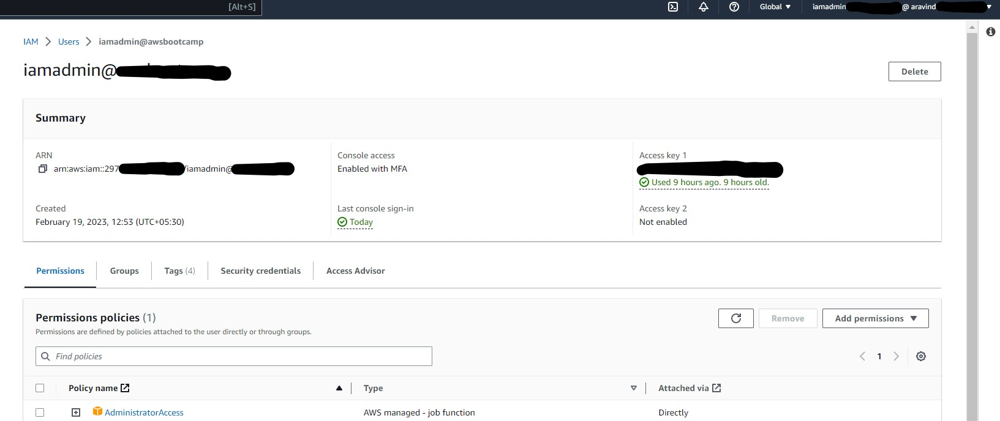

# Week 0 — Billing and Architecture
## AWS
* Created AWS Account for Bootcamp. 
* ### Installed AWS CLI via Gitpod
  

* ### Created Admin user
  

* ### Enabled MFA for AWS Root account and IAM User
   
  

* ### Generated AWS Credentials
  

* ### Set up Monthly budget
   

## Set a threshold alert when actual cost greater than 50% of budgeted amount 

* ### CloudShell
  
