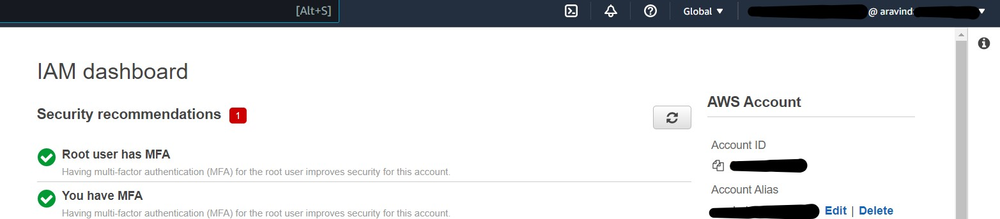

# Week 0 — Billing and Architecture
## AWS
* ### Installed AWS CLI via Gitpod
             
  

* ### Created Admin user
  -     Using the account Root user is not recommended. Here, I have created an IAM user with administrative access.

  

* ### Generated AWS Credentials
  

* ### Set up Monthly budget
      - Set a threshold alert when actual cost greater than 50% of budgeted amount 
    

  
  
* ### Set up Billing Alarm
   

* ### CloudShell
  

  
## Lucid Charts

* ### [Conceptual Diagram](https://lucid.app/lucidchart/9825121a-13d9-40b7-85f4-a35547913061/edit?page=0_0&invitationId=inv_d95a428e-512e-4bb0-b52c-44aa78e462a4#)
   

* ### [Logical Diagram](https://lucid.app/lucidchart/31d5ebe4-ac30-4113-8326-c5dafb48b6aa/edit?page=0_0&invitationId=inv_59bd6ae4-d3bc-4d14-91c1-eb9aa449ded7#)
  

* ### Bonus: Napkin 
  

## Homework Challenges

* ### Enabled MFA for AWS Root account and IAM User
  -     This will act as an additional layer of security. 

   

* ### [CI/CD Pipeline](https://lucid.app/lucidchart/71b64e30-f6bd-472f-8fb8-a8616278d2b7/edit?page=0_0&invitationId=inv_10b01e13-1619-49bd-b730-6b30ae506368#) 
  

* ### Reviewed questions in the Well-Architected Tool
  

