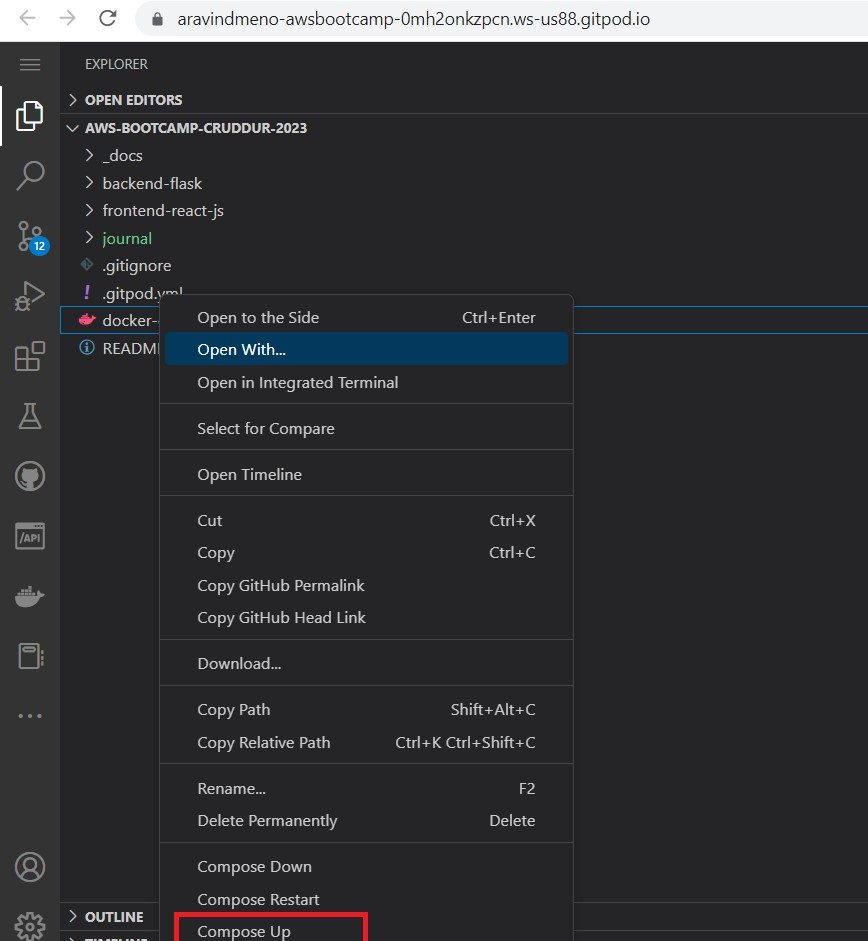

# Week 1 — App Containerization

## Required Homework

## Containerize Backend
Create a [Dockerfile](https://github.com/aravindmenon1197/aws-bootcamp-cruddur-2023/blob/main/backend-flask/Dockerfile) for backend of Cruddur app.


### To run the app on localhost
- Install the required python libraries


- Running the flask app  ``` python3 -m flask run --host=0.0.0.0 --port=4567 ```


### Check for available ports.
- Unlock the required ports. In this case, it is **port 4567 for backend**.
- Open the address for **port 4567**.


- The server is running and accepting requests but it returns **Error 404**


To correct **Error 404**, we have to set environment variables **FRONTEND_URL** and **BACKEND_URL**
```
export FRONTEND_URL="*"
export BACKEND_URL ="*"
```
- Start the server again and open the address for **port 4567** 
- Append the endpoint **``` /api/activities/home ```** to the url.


- We are able to see the json data in the required address.


- Unset the environment variables.
```
unset FRONTEND_URL
unset BACKEND_URL
```
## Build Container

- Change to the main directory
- To build the docker image, run the command **``` docker build -t  backend-flask ./backend-flask ```**


- View the docker image using ``` docker images``` 


## Run Container

- To run the image, we use the command ``` docker run --rm -p 4567:4567 -it backend-flask ```


- Check for available ports.
- Unlock the required ports. In this case, it is **port 4567**.
- Open the address for **port 4567**.
- The server is running and accepting requests but it returns **Error 404** because whe have not set environment variables **FRONTEND_URL** and **BACKEND_URL**.

### To set environment variables
- Attach the shell 


- Check if the environment variables using the **env** command
- Run the image again
```
docker run --rm -p 4567:4567 -it -e FRONTEND_URL='*' -e BACKEND_URL='*' backend-flask
```
- Open the address for **port 4567**  and append the endpoint **``` /api/activities/home ```** to the url.
- We are able to see the json data in the required address.


### To run the image in background, use the command 
```
docker container run --rm -p 4567:4567 -d backend-flask
```

### To view the running containers, use the command ```**docker ps**```


## Containerize Frontend 
We have to run npm install 
```
cd frontend-react-js
npm i
```

Create a [Dockerfile](https://github.com/aravindmenon1197/aws-bootcamp-cruddur-2023/blob/main/frontend-react-js/Dockerfile) for backend of Cruddur app.

```
FROM node:16.18

ENV PORT=3000

COPY . /frontend-react-js
WORKDIR /frontend-react-js
RUN npm install
EXPOSE ${PORT}
CMD ["npm", "start"]
```

## Create **docker-compose.yml** in the root directory
- Compose helps to run multiple containers.
```
version: "3.8"
services:
  backend-flask:
    environment:
      FRONTEND_URL: "https://3000-${GITPOD_WORKSPACE_ID}.${GITPOD_WORKSPACE_CLUSTER_HOST}"
      BACKEND_URL: "https://4567-${GITPOD_WORKSPACE_ID}.${GITPOD_WORKSPACE_CLUSTER_HOST}"
    build: ./backend-flask
    ports:
      - "4567:4567"
    volumes:
      - ./backend-flask:/backend-flask
  frontend-react-js:
    environment:
      REACT_APP_BACKEND_URL: "https://4567-${GITPOD_WORKSPACE_ID}.${GITPOD_WORKSPACE_CLUSTER_HOST}"
    build: ./frontend-react-js
    ports:
      - "3000:3000"
    volumes:
      - ./frontend-react-js:/frontend-react-js

networks: 
  internal-network:
    driver: bridge
    name: cruddur

```
### Start the app either by running ```docker compose -f "docker-compose.yml" up -d --build```  
**OR**




### Check for available ports.
- Unlock the required ports. In this case, it is **port 3000 for frontend**.
- Open the address for **port 4567**.


### We have launched the app successfully


## Implementing notification feature (Backend and Frontend)


### Update open API document


### Update Backend

- We have to add route for notification feature in app.py


- Then, create a new service for notifications


## Adding DynamoDB Local and Postgres

## Homework Challenges 
