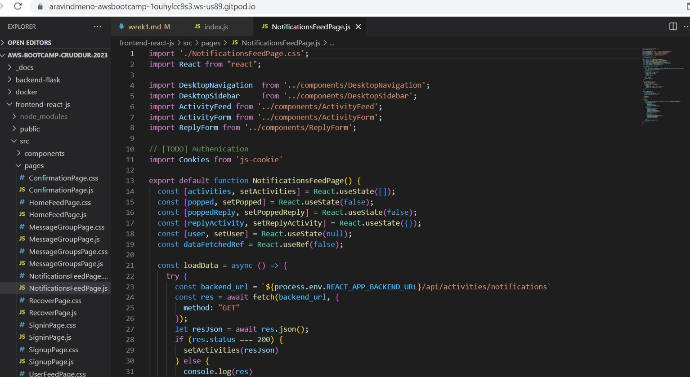

# Week 1 — App Containerization

## Required Homework

## Containerize Backend
Create a [Dockerfile](https://github.com/aravindmenon1197/aws-bootcamp-cruddur-2023/blob/main/backend-flask/Dockerfile) for backend of Cruddur app.


### To run the app on localhost
- Install the required python libraries


- Running the flask app  ``` python3 -m flask run --host=0.0.0.0 --port=4567 ```


### Check for available ports.
- Unlock the required ports. In this case, it is **port 4567 for backend**.
- Open the address for **port 4567**.


- The server is running and accepting requests but it returns **Error 404**


To correct **Error 404**, we have to set environment variables **FRONTEND_URL** and **BACKEND_URL**
```
export FRONTEND_URL="*"
export BACKEND_URL ="*"
```
- Start the server again and open the address for **port 4567** 
- Append the endpoint **``` /api/activities/home ```** to the url.


- We are able to see the json data in the required address.


- Unset the environment variables.
```
unset FRONTEND_URL
unset BACKEND_URL
```
## Build Container

- Change to the main directory
- To build the docker image, run the command **``` docker build -t  backend-flask ./backend-flask ```**


- View the docker image using ``` docker images``` 


## Run Container

- To run the image, we use the command ``` docker run --rm -p 4567:4567 -it backend-flask ```


- Check for available ports.
- Unlock the required ports. In this case, it is **port 4567**.
- Open the address for **port 4567**.
- The server is running and accepting requests but it returns **Error 404** because whe have not set environment variables **FRONTEND_URL** and **BACKEND_URL**.

### To set environment variables
- Attach the shell 


- Check if the environment variables using the **env** command
- Run the image again
```
docker run --rm -p 4567:4567 -it -e FRONTEND_URL='*' -e BACKEND_URL='*' backend-flask
```
- Open the address for **port 4567**  and append the endpoint **``` /api/activities/home ```** to the url.
- We are able to see the json data in the required address.


### To run the image in background, use the command 
```
docker container run --rm -p 4567:4567 -d backend-flask
```

### To view the running containers, use the command ```**docker ps**```


## Containerize Frontend 
We have to run npm install 
```
cd frontend-react-js
npm i
```

Create a [Dockerfile](https://github.com/aravindmenon1197/aws-bootcamp-cruddur-2023/blob/main/frontend-react-js/Dockerfile) for backend of Cruddur app.

```
FROM node:16.18

ENV PORT=3000

COPY . /frontend-react-js
WORKDIR /frontend-react-js
RUN npm install
EXPOSE ${PORT}
CMD ["npm", "start"]
```

## Create **docker-compose.yml** in the root directory
- Compose helps to run multiple containers.
```
version: "3.8"
services:
  backend-flask:
    environment:
      FRONTEND_URL: "https://3000-${GITPOD_WORKSPACE_ID}.${GITPOD_WORKSPACE_CLUSTER_HOST}"
      BACKEND_URL: "https://4567-${GITPOD_WORKSPACE_ID}.${GITPOD_WORKSPACE_CLUSTER_HOST}"
    build: ./backend-flask
    ports:
      - "4567:4567"
    volumes:
      - ./backend-flask:/backend-flask
  frontend-react-js:
    environment:
      REACT_APP_BACKEND_URL: "https://4567-${GITPOD_WORKSPACE_ID}.${GITPOD_WORKSPACE_CLUSTER_HOST}"
    build: ./frontend-react-js
    ports:
      - "3000:3000"
    volumes:
      - ./frontend-react-js:/frontend-react-js

networks: 
  internal-network:
    driver: bridge
    name: cruddur

```
### Start the app byrunning ```docker compose -f "docker-compose.yml" up -d --build```  


### Check for available ports.
- Unlock the required ports. In this case, it is **port 3000 for frontend**.
- Open the address for **port 4567**.


### We have launched the app successfully


## Sign up for Cruddur
- Create a new user

- Confirm your email and enter confirmation code as **1234**


## Implementing notification feature

### We have not set up notifications features for our app hence it returns **404 Not Found**


- Update the [openAPI](/workspace/aws-bootcamp-cruddur-2023/backend-flask/openapi-3.0.yml) file to add an endpoint for notifications.


### Updating the backend for the app to create an endpoint.

- Defining a route for notifications inside [app.py](/workspace/aws-bootcamp-cruddur-2023/backend-flask/app.py)


- Creating a new service for notifications inside [notifications_activities.py](/workspace/aws-bootcamp-cruddur-2023/backend-flask/services/notifications_activities.py)


- Import the service inside [app.py](/workspace/aws-bootcamp-cruddur-2023/backend-flask/app.py)


- Verify the endpoint ```/api/activities/notifications``` to see if it returns the json data.


### Updating the frontend for the app to create an endpoint.

- Create a [NotificationsFeedPage](/workspace/aws-bootcamp-cruddur-2023/frontend-react-js/src/pages/NotificationsFeedPage.js)



- Import the page inside [App.js](/workspace/aws-bootcamp-cruddur-2023/frontend-react-js/src/App.js)


- Add a new path for the notifications page in react


- View the feed by clicking notifications. 


## Adding DynamoDB Local and Postgres

Let’s integrate Postgres and DynamoDB local into our existing [docker-compose](/workspace/aws-bootcamp-cruddur-2023/docker-compose.yml) file.

### Add DynamoDB into docker-compose file.


### Add Postgres into docker-compose file.


### Map the volume to the Postgres database.


### Testing DynamodbLocal 

### Make sure **Port 8000** is unlocked

#### Create a table

```
aws dynamodb create-table \
    --endpoint-url http://localhost:8000 \
    --table-name Music \
    --attribute-definitions \
        AttributeName=Artist,AttributeType=S \
        AttributeName=SongTitle,AttributeType=S \
    --key-schema AttributeName=Artist,KeyType=HASH AttributeName=SongTitle,KeyType=RANGE \
    --provisioned-throughput ReadCapacityUnits=1,WriteCapacityUnits=1 \
    --table-class STANDARD

```


##### Create an item 

```
aws dynamodb put-item \
    --endpoint-url http://localhost:8000 \
    --table-name Music \
    --item \
        '{"Artist": {"S": "No One You Know"}, "SongTitle": {"S": "Call Me Today"}, "AlbumTitle": {"S": "Somewhat Famous"}}' \
    --return-consumed-capacity TOTAL  
    
```


#### List table in dynamodb
``` aws dynamodb list-tables --endpoint-url http://localhost:8000```


### Installing Postgres client
 - Add the following code in [gitpod.yml](/workspace/aws-bootcamp-cruddur-2023/.gitpod.yml) file.

  ```
   - name: postgres
    init: |
      curl -fsSL https://www.postgresql.org/media/keys/ACCC4CF8.asc|sudo gpg --dearmor -o /etc/apt/trusted.gpg.d/postgresql.gpg
      echo "deb http://apt.postgresql.org/pub/repos/apt/ `lsb_release -cs`-pgdg main" |sudo tee  /etc/apt/sources.list.d/pgdg.list
      sudo apt update
      sudo apt install -y postgresql-client-13 libpq-dev
  ```

 

 - Check if the Postgres extension is installed and add it to [gitpod.yml](/workspace/aws-bootcamp-cruddur-2023/.gitpod.yml) file.
  
 

### Run docker compose and make sure necessary ports are unlocked.

### Creating a new connection in database explorer.


### We can connect to postgres using terminal by running the command  ```psql -Upostgres –-host localhost```

  


  


## Homework Challenges 
